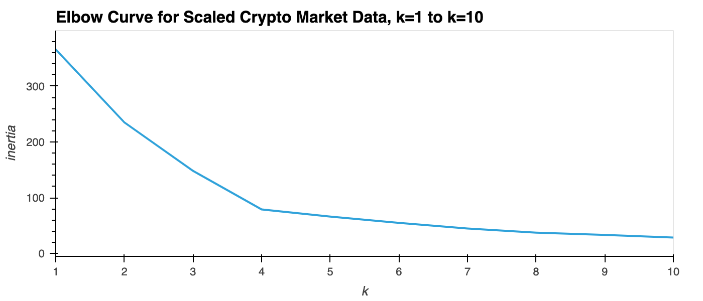
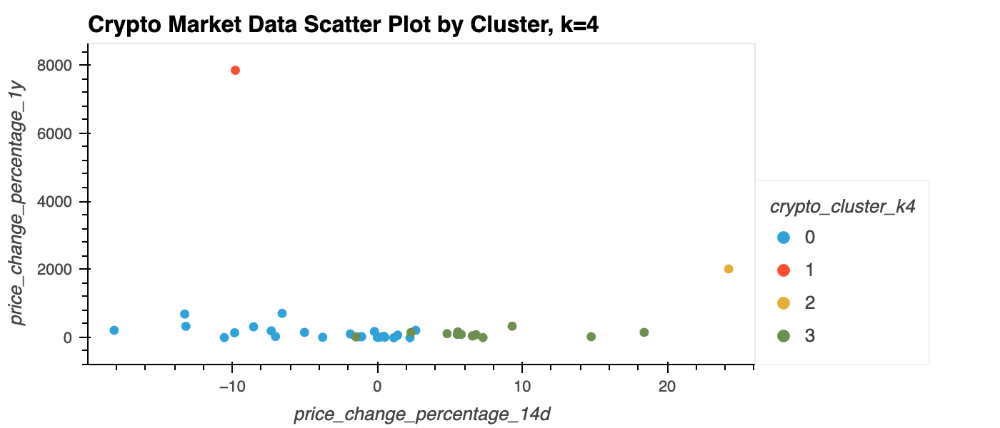

# Crypto Investments Market Data Analysis

This Jupyter notebook provides an analysis of cryptocurrency investments based on market data.

First, it uses the K-Means algorithm (with k=4) to provide cluster various cryptocurrencies by their performance during different time periods.

Next, it uses the Elbow Curve heuristic to find the optimal value of k, and then uses Principal Component Analysis (PCA) to reduce the dimensions of the data into 3 clusters.

Finally, it provides two visualizations of the results with k=4 and k=5.

---

## Technologies

This analysis is a Jupyter lab notebook that makes use of the following Python libraries:
* Pandas
* scikit-learn
* PyViz - hvPlot library

---

## Installation Guide

To use this notebook:
* Install Jupyter lab Version 2.3.1 and Python 3.7.
* Pandas should already be included in the dev environment distribution.  If not, install it.
* Install scikit-learn.
* Install PyViz visualization package.
* Install hvPlot version 0.7.0 or later.
* Install NodeJS version 12 or later.

Open the notebook in Jupyter lab and you can rerun the analysis.

---

## Examples

Here are examples of the interactive plots in this notebook:

---

## Contributors

Michael Danenberg

---

## License

MIT